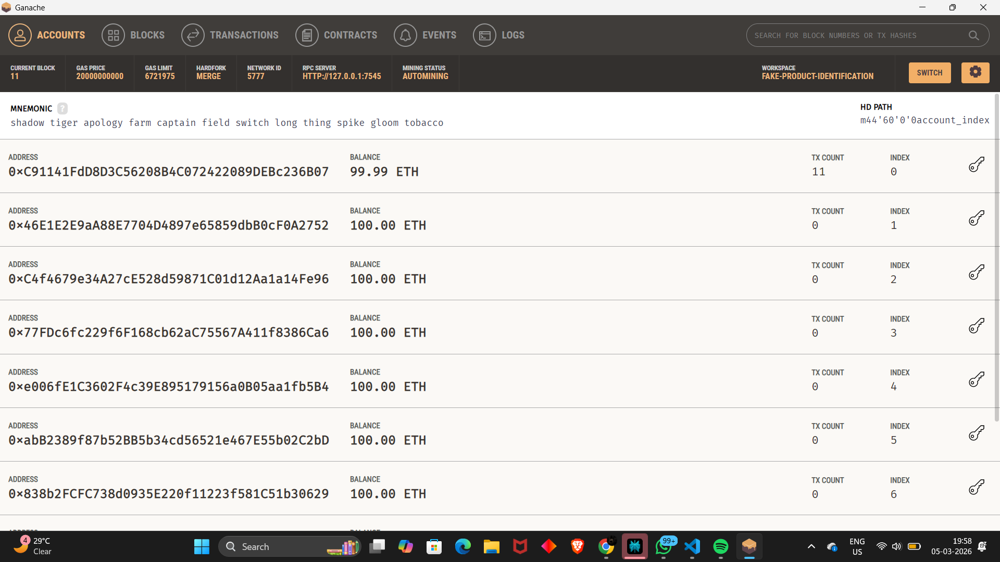
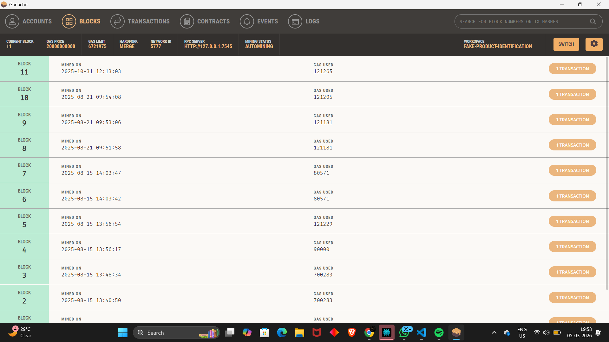
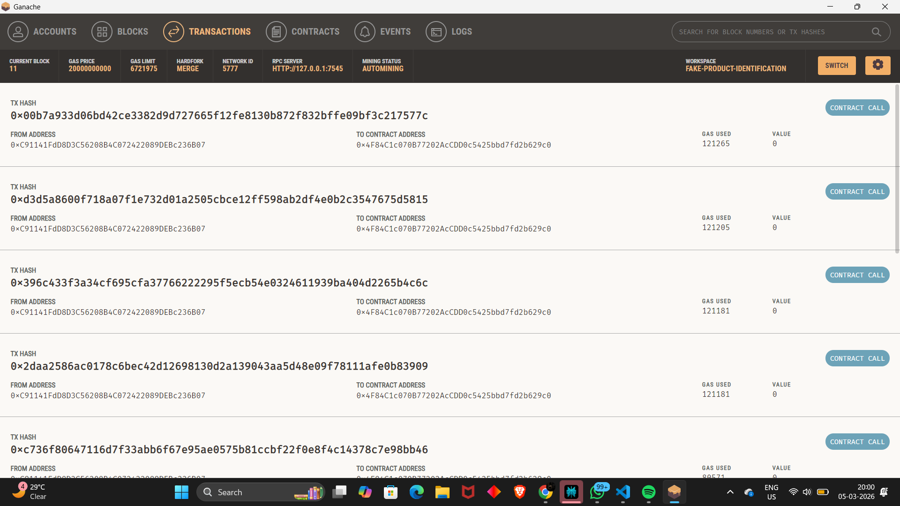
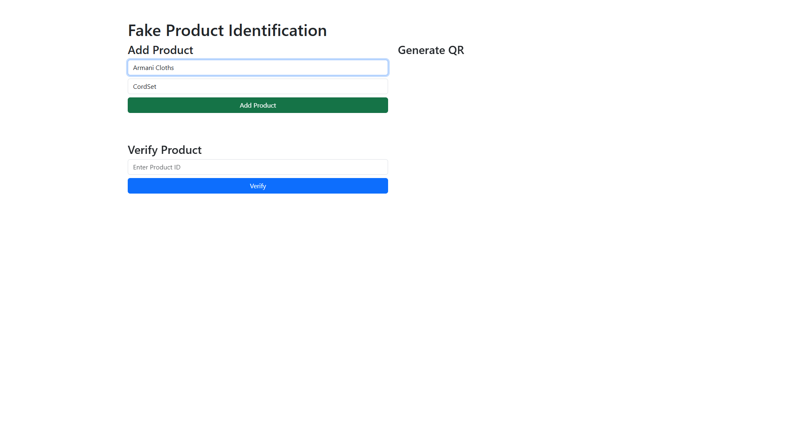
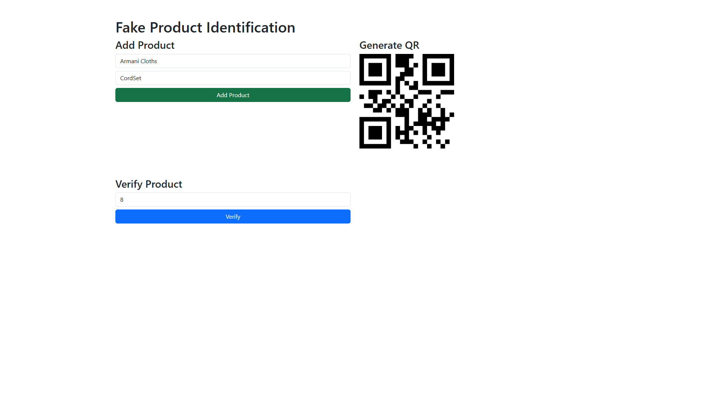
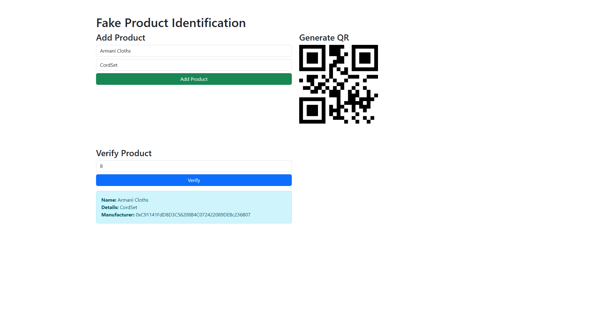

# 🔍 Fake Product Detection DApp
### *Blockchain-Based Counterfeit Product Identification System*

Fake Product Detection DApp is a decentralized application built using **Ethereum**, **Solidity**, **Truffle**, **Ganache**, and **Web3.js**.

The platform allows **manufacturers to register products on the blockchain** and enables **customers to verify product authenticity using a Product ID or QR Code**.

By storing product records on the blockchain, the system ensures **transparency, security, and tamper-proof verification**, helping prevent counterfeit products in the supply chain.

---

## 🚀 Key Features

### 1️⃣ Product Registration
Manufacturers can register their products on the blockchain by entering:

- Product Name  
- Product Details  

Each product receives a **unique Product ID stored permanently on the blockchain**.

---

### 2️⃣ QR Code Generation
After registering a product, the system automatically generates a **QR Code linked to the Product ID**.

This QR code can be printed on product packaging to allow customers to quickly verify authenticity.

---

### 3️⃣ Product Verification
Users can verify product authenticity by entering the **Product ID**.

The system fetches product information directly from the blockchain.

- If product exists → **Authentic Product**
- If product does not exist → **Fake Product**

---

### 4️⃣ Blockchain Transparency
Every product registration generates a **blockchain transaction**, ensuring transparent and immutable records.

These transactions can be monitored in **Ganache**.

---

## 🛠 Tech Stack

### Blockchain & Smart Contracts
- Solidity  
- Ethereum  
- Truffle Framework  
- Ganache (Local Blockchain)

### Frontend
- HTML  
- CSS  
- JavaScript  
- Bootstrap

### Blockchain Integration
- Web3.js  
- Truffle Contract

---

## 📸 User Interface Preview

### 🏦 Ganache Accounts
Displays Ethereum accounts used for transactions and smart contract deployment.



---

### 📦 Blockchain Blocks
Each product registration creates a new block on the blockchain.



---

### 🔗 Blockchain Transactions
All interactions with the smart contract are recorded as transactions.




---

### ➕ Product Registration Interface
Manufacturers can add product information and store it on the blockchain.



---

### 🔳 QR Code Generation
A QR code is generated automatically after product registration.



---

### 🔍 Product Verification Interface
Users can enter the product ID to check authenticity.



---

## ⚙️ Setup & Installation

Follow these steps to run the project locally.

### 1️⃣ Install Dependencies
```bash
npm install -g truffle
npm install
```

---

### 2️⃣ Start Local Blockchain

Open **Ganache** and create a workspace.

Example configuration:

RPC Server
```
http://127.0.0.1:7545
```

Network ID
```
5777
```

---

### 3️⃣ Compile Smart Contracts
```
truffle compile
```

---

### 4️⃣ Deploy Smart Contracts
```
truffle migrate --reset
```

This will deploy the smart contract to the **Ganache local blockchain**.

---

### 5️⃣ Run the Application
Open the frontend in your browser.

```
index.html
```

or

```
http://localhost:3000
```

---

## 📊 Example Product Stored on Blockchain
```
Product Name: Armani Cloths
Details: CordSet
Manufacturer: 0xC91141FdD8D3C56208B4C072422089DEBc236B07
```

Entering the correct **Product ID** will retrieve the stored product information.

---

## 🔐 Why Blockchain?

Traditional product authentication systems rely on centralized databases that can be modified.

Blockchain ensures:

- Immutable product records
- Decentralized verification
- Transparent product authentication
- Secure supply chain tracking

---

## 📌 Future Improvements

Potential upgrades include:

- Mobile app for QR scanning
- IPFS storage for product images
- Manufacturer dashboard
- Deployment on **Polygon or Ethereum Testnet**

---

## 👨‍💻 Author

**Ritesh Mendhe**

Blockchain Developer | Full Stack Developer | Web3 Enthusiast  

LinkedIn  
https://www.linkedin.com/in/ritesh-mendhe-209225294  

GitHub  
https://github.com/riteshmendhe2602  

---

⭐ If you like this project, give it a **star on GitHub**.


